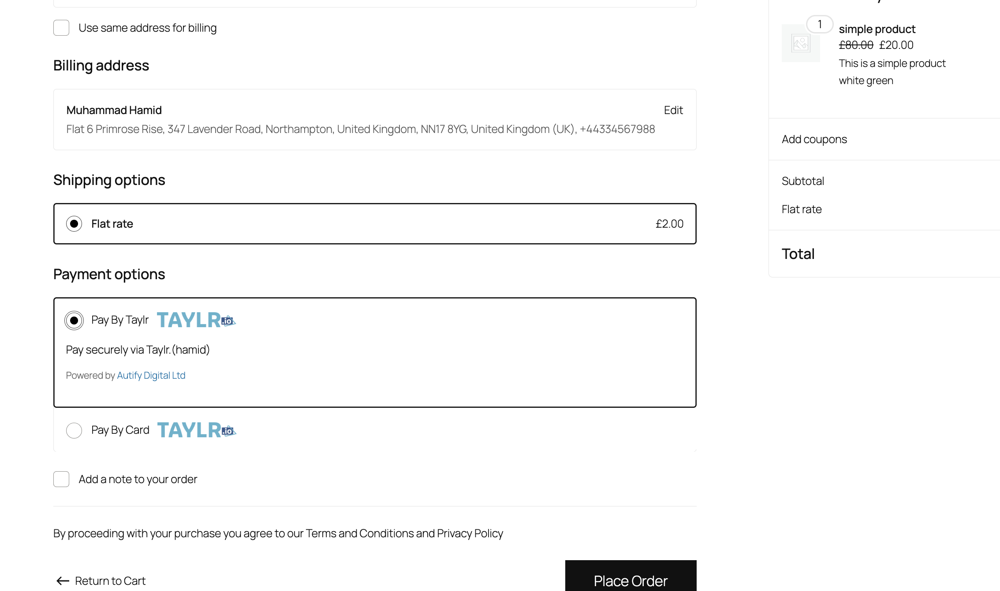
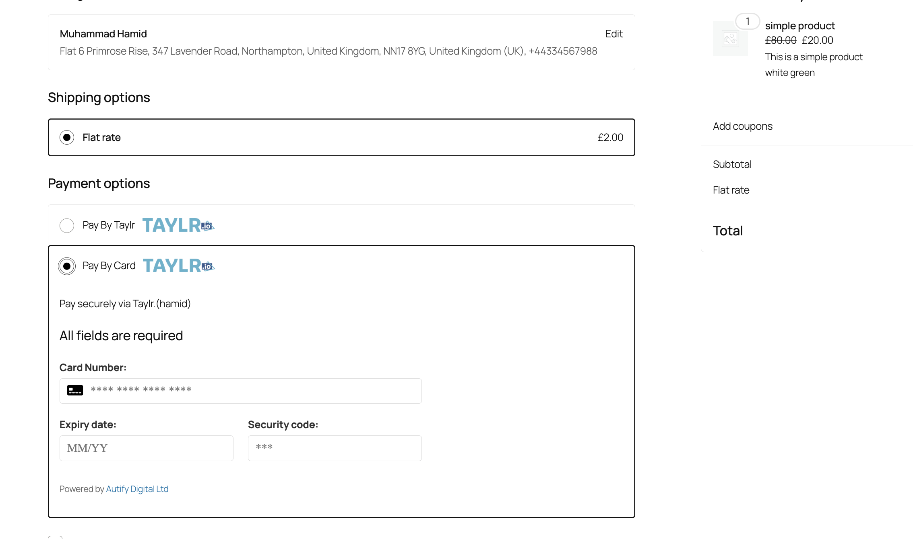
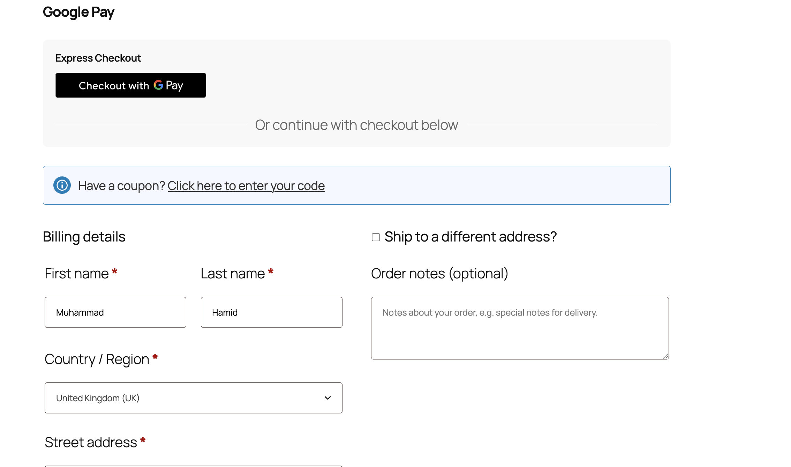
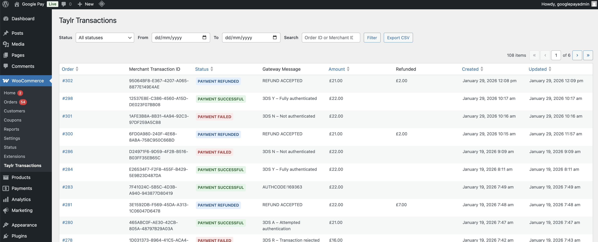
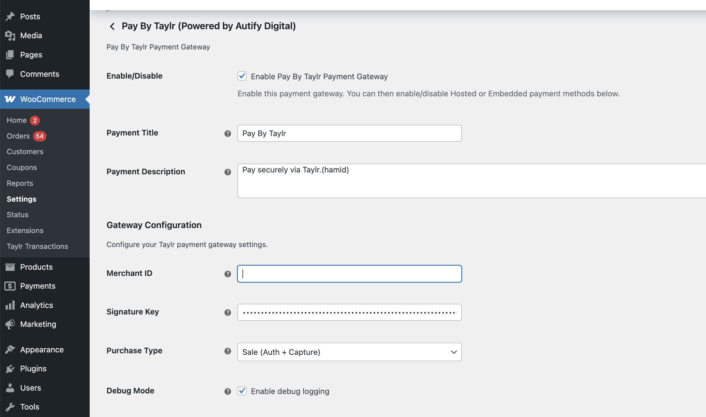
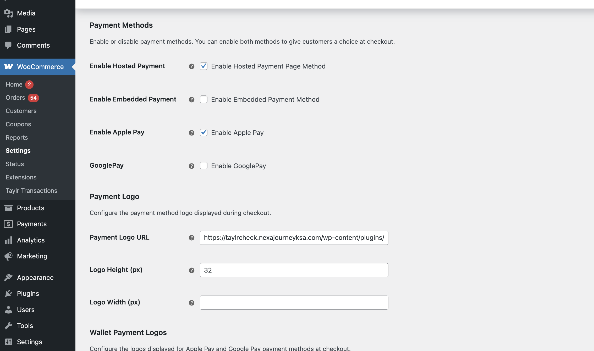

# Autify Digital  Taylr Payment Gateway (WooCommerce)

## Project Overview
Autify Digital Taylr is a custom-built WooCommerce payment gateway integrating with Taylr (payments.taylr.io).  
The plugin supports multiple payment methods, modern WooCommerce checkout systems, 3DS authentication, refunds, webhooks, and a full admin transaction system.

This repository is a **portfolio case study**.  
Source code is not included due to client confidentiality.

## My Role
Senior Full Stack WordPress / WooCommerce Developer

## Technology Stack
- PHP (WooCommerce backend, gateway logic, APIs, refunds, webhooks, 3DS)
- JavaScript (Classic checkout, Block checkout, wallets, admin screens)
- CSS (Frontend checkout styles + admin UI)
- HTML (PHP-rendered views for redirects & 3DS)
- SVG (Payment & wallet icons)
- Gettext (POT) for translations
- MySQL (Custom transaction table)

## Payment Methods Implemented
- **Hosted Payment**
  - Redirect-based flow via Taylr hosted page
  - Order creation → redirect → callback/webhook → order update

- **Direct (Embedded) Card Payment**
  - Card fields rendered on checkout
  - Tokenization via Taylr SDK
  - Supports Classic & Block checkout
  - 3DS handling included

- **Apple Pay**
  - Classic checkout, Block checkout, cart & product (express)
  - Wallet session handling and backend processing

- **Google Pay**
  - Classic checkout, Block checkout, cart & product (express)
  - Token-based backend processing

## Core Architecture
- Single parent gateway managing all shared settings
- Child gateways inherit configuration (direct, Apple Pay, Google Pay)
- Clean separation of controllers, helpers, admin, and frontend assets
- Compatible with HPOS and WooCommerce Cart/Checkout Blocks

## Key Features
- Multi-payment gateway architecture
- 3DS authentication (hosted + direct)
- Secure signature validation (SHA-512)
- Refund processing via Taylr API
- Custom WooCommerce admin transactions table
- Server-to-server webhooks + browser callbacks
- Debug logging with environment control
- Translation-ready plugin structure

## Admin Functionality
- Dedicated **Taylr Transactions** admin screen
- Custom database table for transaction tracking
- Refund status, gateway messages, filters & sorting
- Gateway settings managed from a single parent configuration
- Clean admin UI with conditional asset loading

## Database Design
- Custom transactions table
- Stores order references, amounts, gateway status, refunds, card metadata, and 3DS results
- Backward-compatible migrations included

## Security & UX
- Nonce validation for direct payments
- Signature validation for callbacks & webhooks
- No-cache headers for payment flows
- Checkout-safe handling for Classic & Block environments

## What Is Not Included
- Subscription payments / saved cards (planned future phase)
- Multi-subscription logic
- Source code (restricted by client NDA)

## Screenshots
See the `/screenshots` folder for:
- Checkout payment methods
- Apple Pay / Google Pay buttons
- 3DS flow screens
- Admin transaction listing
- Gateway settings screens

## Disclaimer
This repository is a **technical case study** only.
All implementation details are described without exposing proprietary source code.

screenshots/
├─ checkout-hosted-payment.png
├─ checkout-direct-card.png
├─ apple-pay-checkout.png
├─ apple-pay-cart.png
├─ google-pay-checkout.png
├─ 3ds-authentication.png
├─ admin-transactions-table.png
├─ gateway-settings1.png
├─ gateway-settings2.png

## Screenshots

### Checkout – Payment Methods

### Wallets

### 3DS Authentication

### Admin

